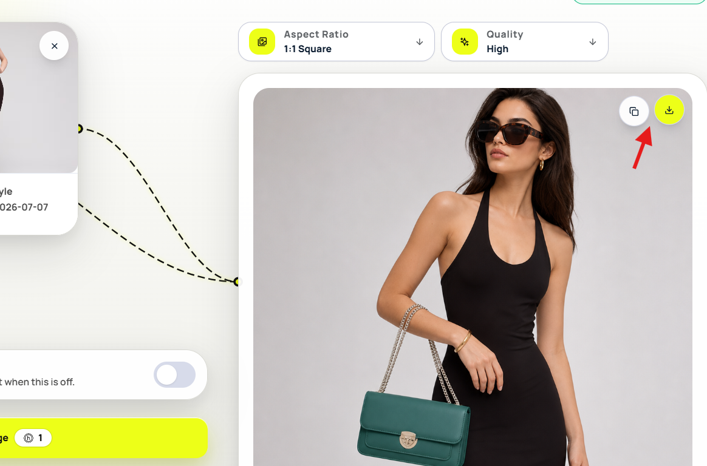

# Download and Copy Images

After Hollapic finishes generating an image, you can download it to your computer or use the copy option shown with the result.

<figure><figcaption></figcaption></figure>

## Download an image

1. Wait for the generation to finish.
2. Review the generated image.
3. Select **Download**.
4. Save the image to your computer.

## Copy an image

1. Open the completed image.
2. Select the available **Copy** action.
3. Paste the copied image where you want to use it.

## Find an older image

Open your generation history to review previous results. Select an image to open it, then use the available download or copy action.

## Related guides

* [Generate Your First Image](../getting-started/generate-your-first-image.md)
* [Common Image Problems](../help/common-image-problems.md)
